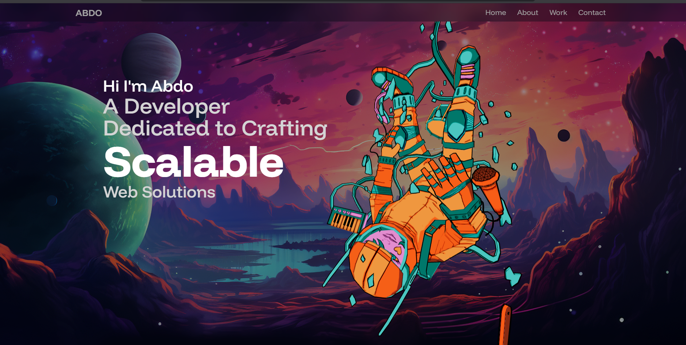
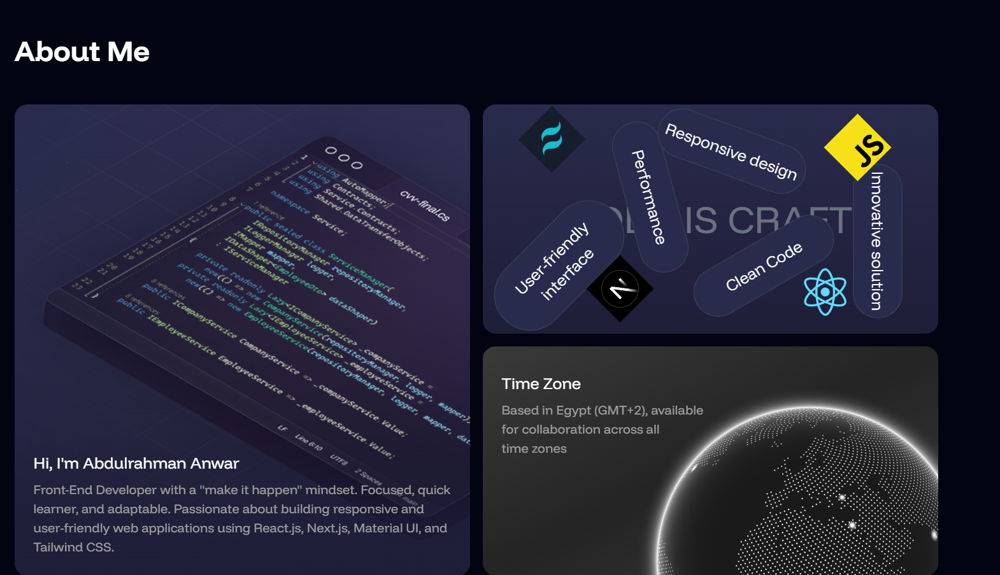

# My 3D Portfolio 🚀

This is my **3D interactive portfolio** built with **React**, **Tailwind CSS**, and **Framer Motion**.  
It showcases my projects and skills in a visually engaging way, with smooth animations and 3D effects.  

## 🔥 Features
- 3D interactive design with React
- Smooth animations using Framer Motion
- Fully responsive with Tailwind CSS
- Showcases projects and skills

## 🌐 Live Demo
[Click here to view the live demo](https://your-portfolio-link.vercel.app)

## 🛠️ Tech Stack
- React  
- Tailwind CSS  
- Framer Motion  

## 📬 Contact
- **GitHub:** [abdoanwar404](https://github.com/abdoanwar404)  
- **LinkedIn:** [Your LinkedIn Profile](https://linkedin.com/in/your-profile)  
- **Email:** yourname@email.com
